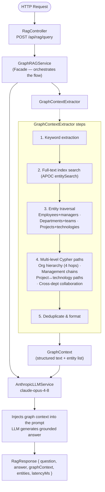
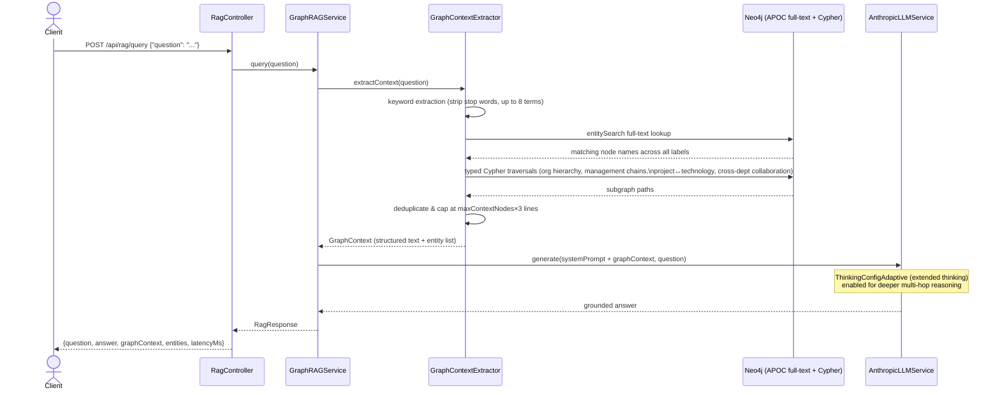
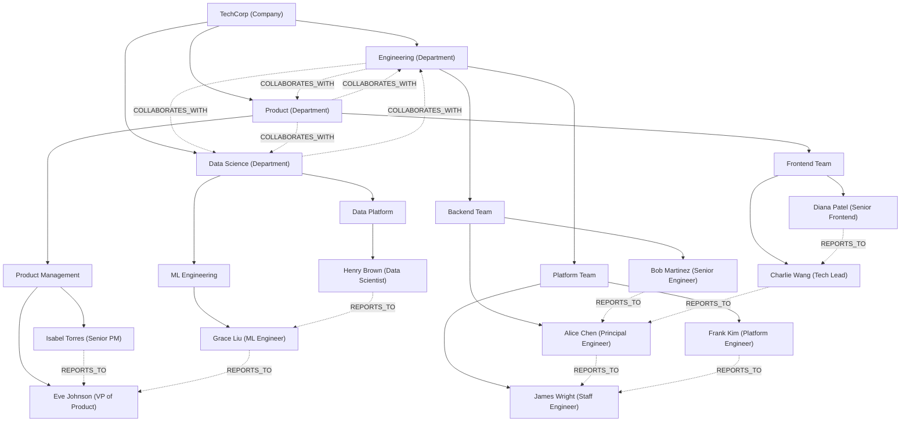

# LLM RAG Graph

A **Graph RAG** (Retrieval-Augmented Generation) pipeline built on **Neo4j** and **Anthropic Claude**.

- Models a 4-level corporate knowledge graph (Company → Department → Team → Employee) for TechCorp
- Answers natural-language questions by traversing typed graph relationships before calling the LLM
- Goes far beyond flat vector search by exploiting the structure encoded in graph edges
- Returns precise, factually-grounded answers — the LLM narrates graph facts rather than inventing them

---

## What is RAG?

- **Retrieval-Augmented Generation (RAG)** combines a structured retrieval step with a large language model
- Instead of relying solely on the model's training-time knowledge, relevant context is fetched at query time
- That context is injected into the prompt, letting the LLM reason over fresh, private, or structured data
- This approach keeps the model grounded and dramatically reduces hallucination on domain-specific questions

---

## Traditional RAG vs Graph RAG

| Dimension                  | Traditional RAG                               | Graph RAG                                                          |
|----------------------------|-----------------------------------------------|--------------------------------------------------------------------|
| **Storage**                | Vector database (embeddings)                  | Graph database (nodes + relationships)                             |
| **Retrieval unit**         | Chunk of text (flat)                          | Paths and subgraphs (structured)                                   |
| **Relationship awareness** | None — chunks are independent                 | First-class — traverses edges at query time                        |
| **Multi-hop reasoning**    | Weak — requires the answer to be in one chunk | Strong — follows chains: Employee → Manager → Department → Project |
| **Context quality**        | Semantically similar text                     | Factually connected entities with typed relationships              |
| **Data freshness**         | Requires re-embedding on updates              | Graph writes are immediately queryable                             |
| **Query type**             | "What does doc X say about topic Y?"          | "Who in Engineering works on ML projects and reports to the CTO?"  |
| **Hallucination risk**     | Higher — context gaps are silent              | Lower — missing relationships return no path, not a wrong answer   |

### Why relationships matter

- Traditional RAG retrieves the most similar text chunks, which requires the full answer to be co-located in a single
  chunk
- Multi-hop questions (e.g., *"Which engineers on the fraud detection project report to Eve?"*) cannot be answered
  reliably this way
- In a knowledge graph the same question becomes a 3-hop Cypher traversal:

```
Employee -[:WORKS_ON]-> Project <-[:WORKS_ON]- Employee -[:REPORTS_TO*]-> Eve
```

- The graph returns precise, structured facts as a result set — not a ranked similarity score
- The LLM's only job is then to narrate those facts in natural language, not to invent or guess them
- Missing relationships return an empty result, making knowledge gaps explicit rather than silent

---

## Architecture



### Query sequence (`POST /api/rag/query`)



---

## Knowledge Graph — TechCorp

The seeder (`GraphDataSeeder`) builds a realistic 4-level corporate hierarchy on startup.



### Projects (cross-cutting)

| Project         | Status | Technologies                                | Owner dept   |
|-----------------|--------|---------------------------------------------|--------------|
| Project Alpha   | active | Java, Spring Boot, Kubernetes, PostgreSQL   | Engineering  |
| Project Beta    | active | React, TypeScript, GraphQL                  | Product      |
| Project Gamma   | active | Python, TensorFlow, Apache Spark, Kafka     | Data Science |
| Project Delta   | active | Apache Kafka, Java, Spring Boot, Kubernetes | Engineering  |
| Project Epsilon | active | Neo4j, Python, Java, Spring Boot            | Data Science |

### Relationship types

| Relationship        | From → To               | Properties                           |
|---------------------|-------------------------|--------------------------------------|
| `HAS_DEPARTMENT`    | Company → Department    | —                                    |
| `HAS_TEAM`          | Department → Team       | —                                    |
| `HAS_MEMBER`        | Team → Employee         | —                                    |
| `REPORTS_TO`        | Employee → Employee     | —                                    |
| `WORKS_ON`          | Employee → Project      | `role`, `allocationPct`, `startDate` |
| `USES_TECHNOLOGY`   | Project → Technology    | —                                    |
| `COLLABORATES_WITH` | Department → Department | —                                    |
| `OWNS_PROJECT`      | Department → Project    | —                                    |

---

## Tech Stack

| Layer       | Technology                                                       |
|-------------|------------------------------------------------------------------|
| Runtime     | Java 25                                                          |
| Framework   | Spring Boot 4.1                                                  |
| Graph DB    | Neo4j 5.x (Spring Data Neo4j)                                    |
| LLM         | Anthropic Claude (claude-opus-4-8) via `anthropic-java` SDK 2.34 |
| Build       | Maven                                                            |
| Boilerplate | Lombok                                                           |

---

## Prerequisites

- Java 25
- Maven 3.9+
- Neo4j 5.x running locally (default: `bolt://localhost:7687`)
- An [Anthropic API key](https://console.anthropic.com/)

---

## Setup

### 1. Start Neo4j

Using Docker:

```bash
docker run -d \
  --name neo4j \
  -p 7474:7474 -p 7687:7687 \
  -e NEO4J_AUTH=neo4j/password \
  neo4j:5
```

Or use [Neo4j Desktop](https://neo4j.com/download/).

### 2. Set environment variables

```bash
export ANTHROPIC_API_KEY=sk-ant-...
export NEO4J_PASSWORD=password       # default: password
```

### 3. Build and run

```bash
./mvnw spring-boot:run
```

- On first startup the application seeds the full TechCorp knowledge graph automatically (`app.graph.seed-data: true`)
- Subsequent restarts detect existing data and skip the seeding step entirely
- No manual Cypher scripts or migrations are required — the seeder is idempotent

---

## API Reference

### Query the RAG pipeline

```
POST /api/rag/query
Content-Type: application/json

{
  "question": "Who are the engineers working on the ML projects and who do they report to?"
}
```

**Response**

```json
{
  "question": "...",
  "answer": "Grace Liu (ML Engineer) leads Project Gamma...",
  "graphContext": "=== Graph Knowledge Context ===\n• Employee Grace Liu...",
  "entities": ["Grace Liu", "Project Gamma", "Data Science"],
  "latencyMs": 1240
}
```

### Graph inspection endpoints

| Method | Path                                    | Description                        |
|--------|-----------------------------------------|------------------------------------|
| `GET`  | `/api/graph/stats`                      | Node and relationship counts       |
| `GET`  | `/api/graph/companies/{name}/hierarchy` | Full company hierarchy             |
| `GET`  | `/api/graph/companies/{name}/employees` | All employees in a company         |
| `GET`  | `/api/graph/employees/{name}/context`   | Employee with projects and manager |
| `GET`  | `/api/graph/employees/{name}/reports`   | Direct reports of an employee      |
| `GET`  | `/api/graph/projects/{name}/team`       | Everyone working on a project      |

### Health check

```
GET /actuator/health
```

---

## Example questions to try

```
Who does Alice Chen report to?
Which engineers have Kubernetes skills?
What technologies does Project Gamma use?
Who is working on Project Epsilon and in what role?
Which departments collaborate with Engineering?
List all employees in the Data Science department.
Who are Grace Liu's direct reports?
What projects is James Wright involved in?
```

---

## Configuration

Key settings in `application.yaml`:

```yaml
app:
  anthropic:
    model: claude-opus-4-8   # LLM model
    max-tokens: 4096
  graph:
    seed-data: true           # auto-seed on first boot
    context-depth: 4          # max relationship hops
    max-context-nodes: 20     # cap on retrieved entities
```

---

## How the context extraction works

1. **Keyword extraction** — stop words are stripped; up to 8 meaningful terms are pulled from the question.
2. **Full-text index search** — Neo4j's `entitySearch` index is queried for matching node names across all labels.
3. **Typed traversals** — for each keyword, four specialised Cypher queries run in parallel:
    - Org hierarchy paths: `Company → Department → Team → Employee`
    - Project paths: `Employee → Project → Technology`
    - Management chains: `Employee -[:REPORTS_TO*1..3]-> Manager`
    - Cross-department collaboration: `Department -[:COLLABORATES_WITH]-> Department`
4. **Deduplication and capping** — results are deduplicated and capped at `maxContextNodes × 3` lines.
5. **Prompt injection** — the formatted context block is prepended to the LLM prompt so Claude reasons over graph facts,
   not its training weights.

## 🧩 Design patterns

- `GraphRAGService` acts as a **Facade** over the full multi-step flow: keyword extraction → graph traversal → prompt
  assembly → LLM call
    - Callers interact with a single `query(String question)` method; none of the internal steps are exposed
- Spring Data Neo4j repositories follow the **Repository** pattern, keeping Cypher queries isolated from service logic
- There is a single LLM provider (`AnthropicLLMService`), so a Strategy interface for LLM providers is deliberately not
  introduced — adding one would be speculative abstraction
- See the [Design patterns section](../llm-rag-pipeline/README.md#-design-patterns-gof) in `llm-rag-pipeline` for the
  full GoF pattern inventory used across the llm-rag modules and the reasoning about where patterns are deliberately not
  applied

## LLM Integration — Anthropic Java SDK (not Spring AI)

`AnthropicLLMService` calls Claude via the **`anthropic-java` SDK** (version 2.34) directly, bypassing Spring AI's
`ChatClient` abstraction entirely. This is intentional: Anthropic-specific features — extended thinking mode and
fine-grained token budget control — were not surfaced through the Spring AI model options at the time of development.

```java
// Extended thinking — lets Claude reason silently before composing the final answer
ThinkingConfigAdaptive.builder().build()
```

The service builds a `MessageCreateParams` with:

- System prompt (graph-context block injected before the user question)
- User question
- `ThinkingConfigAdaptive` — enables Claude's hidden chain-of-thought; the model produces a reasoning trace that is not
  visible in the response but improves answer accuracy on multi-hop graph questions
- Model: `claude-opus-4-8` (configured in `app.anthropic.model`)
- `AnthropicOkHttpClient.fromEnv()` — picks up `ANTHROPIC_API_KEY` automatically; no manual client wiring required

### Why not Spring AI's ChatClient?

| Spring AI `ChatClient`                   | Anthropic Java SDK                                        |
|------------------------------------------|-----------------------------------------------------------|
| Provider-neutral abstraction             | Direct access to all Anthropic-specific parameters        |
| Does not expose `ThinkingConfigAdaptive` | `ThinkingConfigAdaptive` built into `MessageCreateParams` |
| Adds transitive Spring AI dependencies   | Lightweight; only `anthropic-java` jar required           |
| Good fit for multi-provider or advisors  | Good fit when you need precise model control              |

### Resilience

All Anthropic calls are guarded by Resilience4j via Spring AOP annotations:

| Decorator                                                                    | Configuration key                                       | Behaviour                                                                                                                                         |
|------------------------------------------------------------------------------|---------------------------------------------------------|---------------------------------------------------------------------------------------------------------------------------------------------------|
| `@CircuitBreaker(name = "llm-rag-graph", fallbackMethod = "fallbackAnswer")` | `resilience4j.circuitbreaker.instances.llm-rag-graph.*` | Opens after consecutive failures; returns a graceful degradation message from `fallbackAnswer` — the endpoint never throws 500 during LLM outages |
| `@Retry(name = "llm-rag-graph")`                                             | `resilience4j.retry.instances.llm-rag-graph.*`          | Retries transient network errors before the circuit-breaker counts a failure; uses exponential back-off                                           |

The `fallbackAnswer` method returns a structured `RagResponse` with a "service temporarily unavailable" message so
clients always receive a valid JSON response.

---

## 🏗️ Build & test

```bash
mvn test
```

- Tests run **offline** — the `test` profile disables graph seeding and supplies a dummy Anthropic key
- No running Neo4j instance or real API key is required to execute the test suite
- `GraphRAGServiceTest` unit-tests the full RAG orchestration path:
    - Context extraction → LLM answer → response assembly
    - Graph-stats aggregation logic
    - All collaborators (Neo4j repositories, `AnthropicLLMService`) are mocked with Mockito
- `LlmRagGraphApplicationTests` verifies that the Spring application context assembles cleanly without errors
