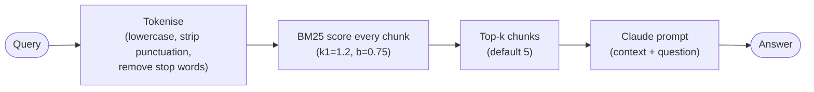
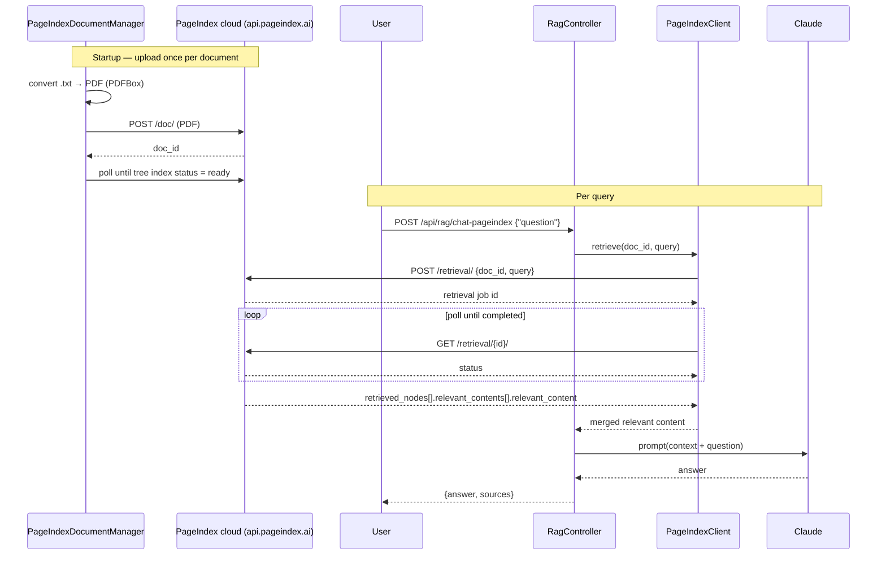

# <span style="color:hsl(216,68%,44%)">LLM Vectorless RAG</span>

Two vectorless retrieval approaches backed by Claude for generation — no embeddings, no vector databases, no GPU.

| Retriever | Endpoint                       | How it works                                   |
|-----------|--------------------------------|------------------------------------------------|
| BM25      | `POST /api/rag/chat`           | In-process keyword ranking — always available  |
| PageIndex | `POST /api/rag/chat-pageindex` | Cloud tree-reasoning — enabled with an API key |

---

## <span style="color:hsl(234,68%,44%)">What is Vectorless RAG?</span>

- **Standard RAG** converts every document chunk into a high-dimensional vector using an embedding model
    - Those vectors are stored in a vector database (Pinecone, Weaviate, pgvector, etc.)
    - At query time, chunks are retrieved by cosine similarity to the embedded query
    - This captures semantic meaning effectively but introduces significant operational overhead
- **The cost of standard RAG** includes an embedding model (often GPU-backed), a running vector database, and extra
  latency and API cost on every ingestion and query request
- **Vectorless RAG** achieves the same goal — grounding LLM answers in your documents — without any of that
  infrastructure
    - No embedding model is required for indexing or retrieval
    - No vector database needs to be deployed or maintained
    - The two approaches implemented here (BM25 and PageIndex) cover both offline/local and cloud use cases

---

## <span style="color:hsl(252,68%,44%)">Retriever 1 — BM25 (local, always-on)</span>

- **BM25 (Best Match 25)** is a classic probabilistic information-retrieval ranking function developed from the BM (Best
  Match) family of models
- The index is built entirely in-memory at application startup — no external process or service is required
- Queries run in-process with sub-millisecond latency and no network calls



**Scoring formula:**

```
score(d, q) = Σ  IDF(t) × tf(t,d)×(k1+1) / (tf(t,d) + k1×(1 − b + b×|d|/avgdl))

IDF(t) = log( (N − df(t) + 0.5) / (df(t) + 0.5) + 1 )
```

- **TF** rewards chunks where the query word appears often, with diminishing returns
- **IDF** rewards rare, informative words over common ones
- **k1=1.2** — TF saturation; **b=0.75** — length normalisation

---

## <span style="color:hsl(270,68%,44%)">Retriever 2 — PageIndex (cloud, reasoning-based)</span>

- [PageIndex](https://pageindex.ai) by VectifyAI is a vectorless RAG cloud service with no embedding step on either the
  indexing or query side
- Instead of splitting documents into fixed chunks and comparing embedding vectors, PageIndex builds a **hierarchical
  tree index** — conceptually similar to an intelligent, auto-generated table of contents
- At query time, LLM reasoning is used to navigate the tree (evaluating section titles and summaries) rather than
  running a vector similarity search
- The tree search is entirely driven by language understanding, enabling accurate retrieval on long or complex documents



---

## <span style="color:hsl(288,68%,44%)">Project Architecture</span>

```
src/main/
├── resources/
│   ├── application.yaml
│   └── documents/               ← .txt files — the knowledge base
│       ├── vectorless-rag.txt
│       ├── spring-ai-guide.txt
│       └── java-21-features.txt
└── java/com/rag/vectorless/
    ├── config/
    │   └── AppConfig.java              ← ChatClient bean with system prompt
    ├── controller/
    │   └── RagController.java          ← REST endpoints
    ├── dto/
    │   ├── Chunk.java                  ← record: id, text, source, chunkIndex
    │   ├── ChatRequest.java            ← record: question
    │   └── ChatResponse.java           ← record: answer, sources
    └── rag/
        ├── DocumentLoader.java         ← loads .txt files, splits into chunks
        ├── BM25Retriever.java          ← builds BM25 index at startup
        ├── PageIndexClient.java        ← HTTP client for api.pageindex.ai (optional)
        └── PageIndexDocumentManager.java ← uploads docs to PageIndex at startup (optional)
```

### <span style="color:hsl(306,68%,44%)">Startup sequence (BM25 always runs; PageIndex is conditional)</span>

1. `DocumentLoader` reads all `*.txt` files, splits into 500-char overlapping chunks.
2. `BM25Retriever` builds the in-memory TF/IDF index from those chunks.
3. *(If `RAG_PAGEINDEX_ENABLED=true`)* `PageIndexDocumentManager` converts each `.txt` to a PDF (via PDFBox), uploads to
   `api.pageindex.ai/doc/`, and waits for PageIndex to finish building the tree index.

### <span style="color:hsl(324,68%,44%)">Request flow — BM25 (`POST /api/rag/chat`)</span>

1. Tokenise the query (lowercase, strip punctuation, remove stop words).
2. Score every chunk with BM25; pick top-k (default 5).
3. Concatenate chunk text into a context block.
4. Call Claude with the augmented prompt.

### <span style="color:hsl(342,68%,44%)">Request flow — PageIndex (`POST /api/rag/chat-pageindex`)</span>

1. For each indexed document, call `POST /retrieval/` with the doc_id + query.
2. Poll `GET /retrieval/{id}/` until status = `completed`.
3. Extract `retrieved_nodes[*].relevant_contents[*].relevant_content`.
4. Merge content from all documents and call Claude with the augmented prompt.

---

## <span style="color:hsl(0,68%,44%)">API Endpoints</span>

### <span style="color:hsl(18,68%,44%)">`POST /api/rag/chat`</span>

BM25 retrieval + Claude. No external dependencies.

```json
// request
{ "question": "How does BM25 handle document length?" }

// response
{ "answer": "BM25 normalises by dividing by average document length ...", "sources": ["vectorless-rag.txt"] }
```

### <span style="color:hsl(36,68%,44%)">`POST /api/rag/chat-pageindex`</span>

PageIndex tree-reasoning retrieval + Claude. Requires PageIndex to be enabled.

```json
// request
{ "question": "What are Java 21 virtual threads?" }

// response
{ "answer": "Virtual threads are lightweight threads managed by the JVM ...", "sources": ["java-21-features.txt"] }
```

### <span style="color:hsl(54,68%,32%)">`GET /api/rag/documents`</span>

```json
{ "documents": ["java-21-features.txt", "spring-ai-guide.txt", "vectorless-rag.txt"], "totalChunks": 42 }
```

### <span style="color:hsl(72,68%,32%)">`GET /api/rag/health`</span>

```json
{ "status": "ok", "chunks": 42, "pageindex": "enabled", "pageindexDocs": 3 }
```

---

## <span style="color:hsl(90,68%,32%)">Configuration</span>

```yaml
# application.yaml
spring:
  ai:
    anthropic:
      api-key: ${ANTHROPIC_API_KEY}
      chat:
        options:
          model: claude-opus-4-8
          max-tokens: 1024

rag:
  chunk-size: 500      # characters per BM25 chunk
  chunk-overlap: 100   # overlap between adjacent chunks
  top-k: 5             # chunks returned by BM25 per query
  pageindex:
    enabled: ${RAG_PAGEINDEX_ENABLED:false}
    api-key: ${PAGEINDEX_API_KEY:}
```

---

## <span style="color:hsl(108,68%,32%)">Running Locally</span>

**Prerequisites:** Java 25, Maven 3.9+, Anthropic API key.

### <span style="color:hsl(126,68%,32%)">BM25 only</span>

```bash
export ANTHROPIC_API_KEY=sk-ant-...
./mvnw spring-boot:run
```

### <span style="color:hsl(144,68%,32%)">BM25 + PageIndex</span>

```bash
export ANTHROPIC_API_KEY=sk-ant-...
export PAGEINDEX_API_KEY=<your-pageindex-api-key>   # from app.pageindex.ai
export RAG_PAGEINDEX_ENABLED=true
./mvnw spring-boot:run
```

- On startup, all `.txt` files are converted to PDFs (via PDFBox) and uploaded to PageIndex
- PageIndex builds its tree index asynchronously in the cloud; the app waits for all documents to reach `ready` status
  before accepting requests
- Expect approximately 30–60 seconds per document for the initial tree-building phase on the cloud service
- **Adding documents:** drop any `.txt` file into `src/main/resources/documents/`
    - BM25 index rebuilds automatically on the next startup from all files present in that directory
    - PageIndex re-uploads and re-indexes the new file on next startup (existing documents are not re-processed if their
      doc_id is already recorded)

**Example — compare both retrievers on the same question:**

```bash
curl -s -X POST http://localhost:8080/api/rag/chat \
  -H 'Content-Type: application/json' \
  -d '{"question": "What is BM25?"}' | jq .

curl -s -X POST http://localhost:8080/api/rag/chat-pageindex \
  -H 'Content-Type: application/json' \
  -d '{"question": "What is BM25?"}' | jq .
```

---

## <span style="color:hsl(162,68%,36%)">BM25 vs PageIndex</span>

|                            | BM25                            | PageIndex                             |
|----------------------------|---------------------------------|---------------------------------------|
| **Infrastructure**         | None — pure in-memory           | PageIndex cloud API                   |
| **Startup**                | Milliseconds                    | ~30–60 s per document (tree building) |
| **Query latency**          | ~1 ms in-process                | ~5–30 s (async retrieval API)         |
| **Retrieval method**       | Keyword term frequency          | LLM reasoning over tree index         |
| **Semantic understanding** | No — exact keyword overlap      | Yes — LLM understands meaning         |
| **Best for**               | Keyword-heavy technical queries | Complex questions, long documents     |
| **Accuracy benchmark**     | —                               | 98.7% on FinanceBench                 |
| **Cost**                   | Free                            | PageIndex API credits                 |

Sources:

- [PageIndex documentation](https://docs.pageindex.ai/)
- [PageIndex GitHub (VectifyAI/PageIndex)](https://github.com/VectifyAI/PageIndex)
- [Vectorless RAG cookbook](https://docs.pageindex.ai/cookbook/vectorless-rag-pageindex)

## <span style="color:hsl(180,68%,36%)">🧩 Design patterns</span>

- The two retrieval paths (local **BM25** and remote **PageIndex**) are exposed as separate endpoints with intentionally
  different response shapes
- A common Strategy interface is deliberately **not** introduced for these two retrievers:
    - The variation point does not exist at runtime — PageIndex is toggled by `@ConditionalOnProperty`, not selected per
      request
    - Forcing both paths behind a shared interface would be speculative abstraction with no current caller
    - The simpler design keeps each path independently testable and deployable
- See the [Design patterns section](../llm-rag-pipeline/README.md#-design-patterns-gof) in `llm-rag-pipeline` for the
  full GoF pattern inventory used across the llm-rag modules

## <span style="color:hsl(198,68%,36%)">🏗️ Build & test</span>

```bash
mvn test
```

- Tests run **offline** with no live API keys required — the `test` Spring profile supplies a dummy Anthropic key and
  disables PageIndex
- `BM25RetrieverTest` covers the core ranking behaviour:
    - Chunks containing query keywords are ranked above non-matching chunks
    - Stop-word-only queries and no-match queries both return an empty result set
- `LlmVectorlessRagApplicationTests` verifies that the full Spring application context assembles cleanly with the test
  profile active
